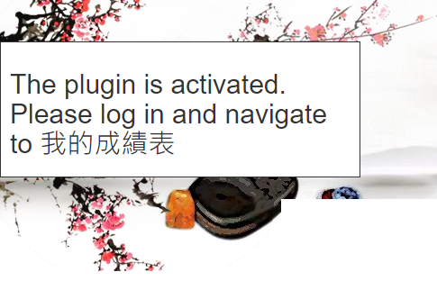

# AutoCompleteiLeaner
For 智X中文平台. Currently for MC only.
[Video tutorial](https://www.youtube.com/watch?v=cMhIG1ozJfU)

# Installation
1. Download the file from release page or [link here](https://github.com/watermelonoof/AutoCompleteiLearner/releases/latest/download/autocomplete-i-learner.user.js)
2. Install Violentmonkey extension on Chrome [link here](https://chrome.google.com/webstore/detail/violentmonkey/jinjaccalgkegednnccohejagnlnfdag)
3. Click `Manage extension`, turn on `Allow access to file URLs`
4. Drag and drop the file from **step 1** onto Chrome
5. Open 智X中文平台. If the installation is successful you should see a panel saying the plugin is activated as shown below

# Usage
1. Login to your account
2. Navigate to `我的成績表`
3. Click `Start`. (This will open a new tab and start the process. If you need to stop it go back to panel and click `Stop`. Closing it will only cause it to start completing the next task)
4. If the current `我的成績表` page has all tasks completed go to the next page and repeat step 3.
5. (Optional) You can enable a randomised delay to avoid suspicious activity

# Note
1. To click the `Manage extension`: click on the puzzle icon, find Violentmonkey, click the icon with three dots.
2. For non-mcq please complete manually, submit and go to the next page and the plugin will continue working; if it is the last exercise page, close the tab upon completion

# Uninstallation
Simply disable / delete the extension